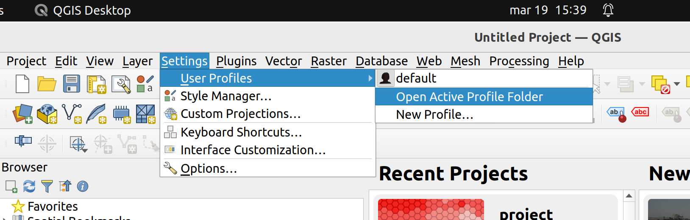
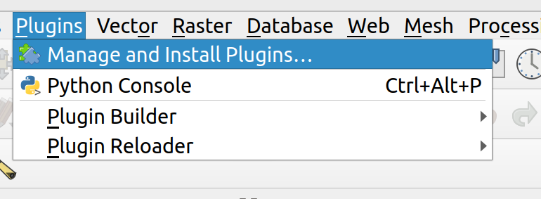
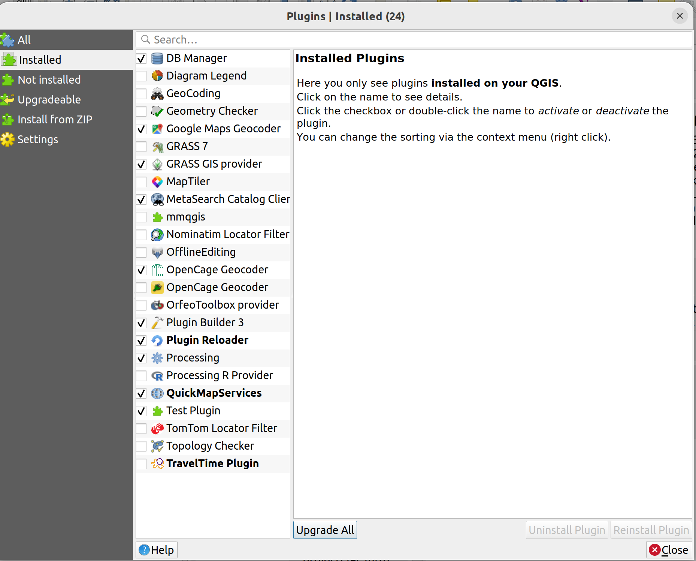
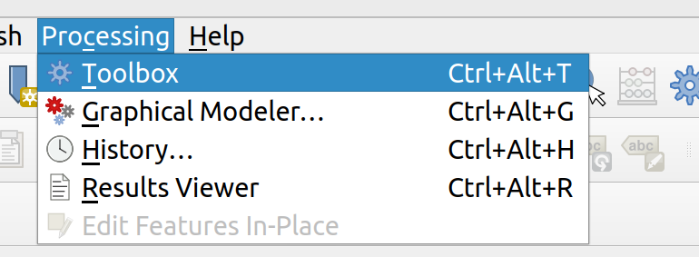
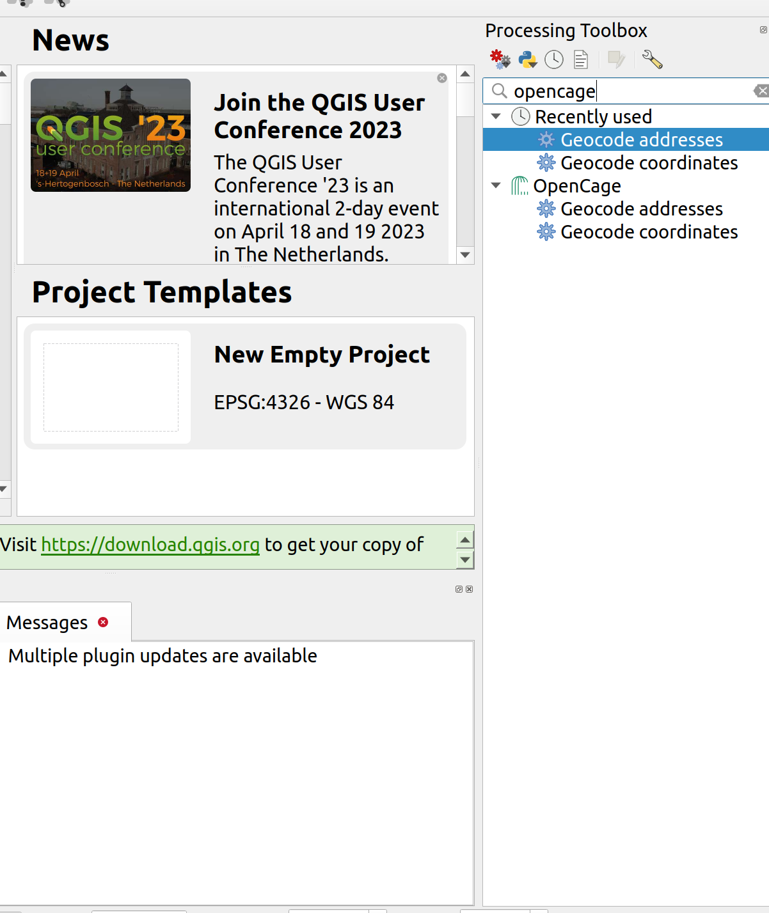
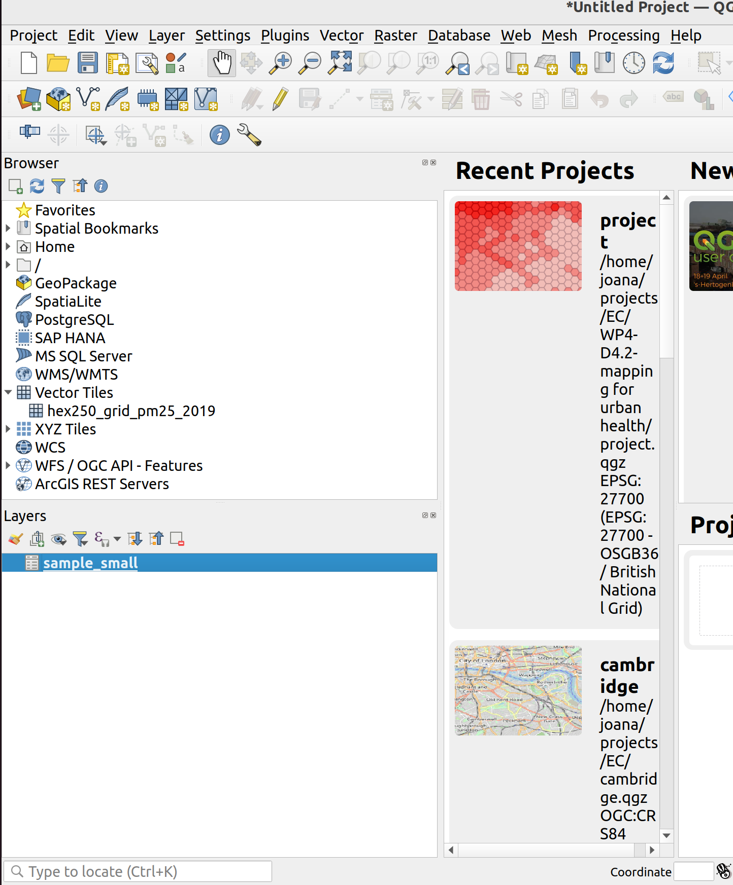
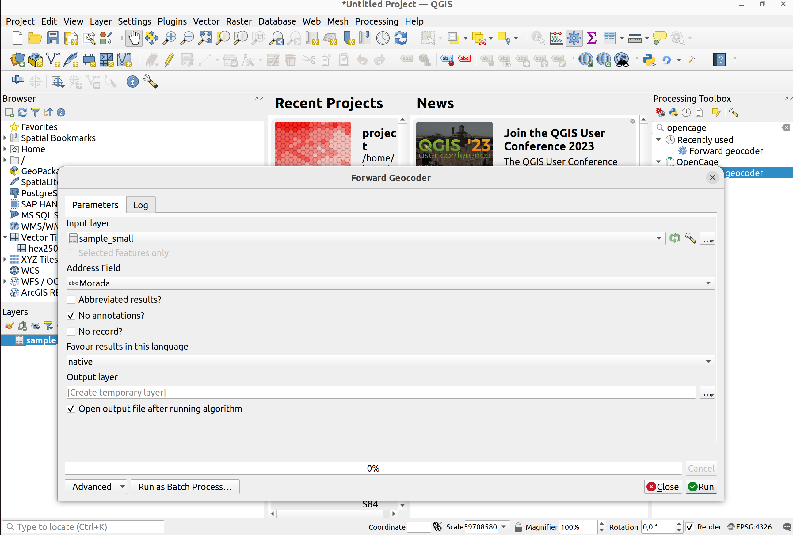
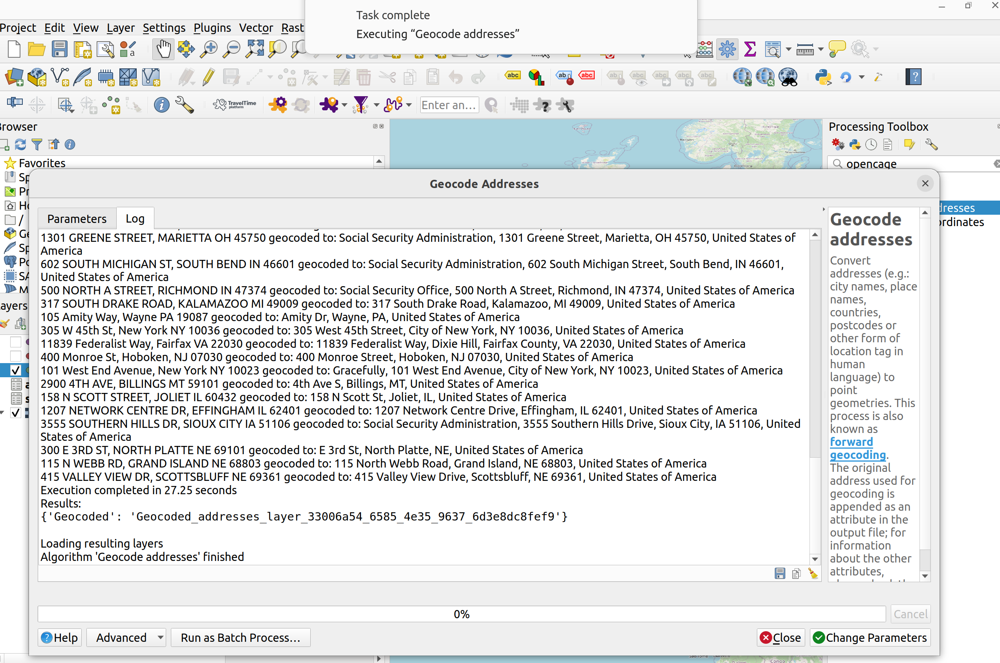
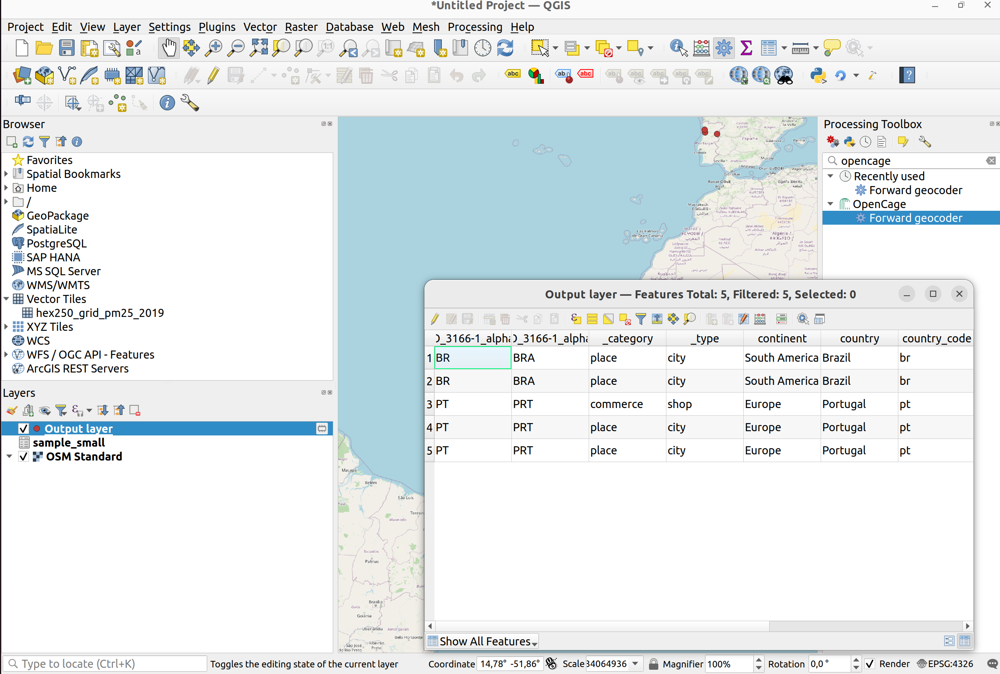

# OpenCage Geocoder QGIS Plugin

This processing plugin enables geocoding using the [OpenCage Geocoding API](https://opencagedata.com). In order to use it, you need to [sign up](https://opencagedata.com/users/sign_up) for an API key first. Sign up is quick and free.

## Manual Install

### Short Version

* Copy the entire directory containing the plugin to the QGIS plugin directory
* Enable the plugin the QGIS plugin manager

### Long Version

1. Copy the source code to the plugin Folder

The source code is the sub-folder `opencage_geocoder`, on this repository. To find out where the plugin folder is located in your machine, in the top-level menu of QGIS choose `Settings->User Profiles->Open Active Folder`.  From that path, navigate to `Python->Plugins`

1. Enable the plugin in the QGIS plugin manager

Access the top level menu and choose `Plugins->Install Plugins`.

 On the left panel, select `Installed`: the opencage geocoder plugin should be listed. Select it to enable it and close the dialog.

 

## Using the Plugin

After enabling the plugin, its algorithms will be available in the `processing toolbox`. To enable the toolbox choose `Processing->Toolbox` in the top level menu. This will enable panel on the right side of QGIS.

 

You can browse the processing panel to find the `Opencage` provider, or type `opencage` in the searchbar, to filter it. Under the `Opencage` provider, you will find the available algorithms. You can click any of them to run them.

 

### Forward Geocoding

Before runnning this algorithm you will need a text file (csv), with a field which contains locations in natural language (addresses, cities, postcodes); this will be the input of the geocoding algorithm. You can use the [sample](./tests/sample_small.csv) provided in the test folder. Add it to QGIS, by dragging the file into the layers panel on the left

 

To run the forward geocoding algorithm, click in `Forward`. This will open a dialog with options. In the input layer, choose the file you just added (it should be added by default, if you don't have any more layers). Then select the field which contains the location you want to geocode; in this case, `Morada`. Select the other options as appropriate and choose `Run`. 

 

The geocode process will run in the background and show you a log of what is happening. When completed it will automatically add a vector file to the QGIS layer browser, which contains the geocoded locations, along with other structured information (depending on the options you selected). If you want to persist this file, you should export the layer to a geospatial format (e.g.: Geopackage, GeoJSON, etc).

 

  

## Develop

  * You can use the ` Makefile` to compile and deploy when you make changes. This requires GNU make (gmake). The Makefile is ready to use, however you  will have to edit it to add addional Python source files, dialogs, and translations.
  * You can also use `pb_tool` to compile and deploy your plugin. Tweak the `pb_tool.cfg`  file included with your plugin as you add files. Install `pb_tool` using 
  `pip` or `easy_install`. See http://loc8.cc/pb_tool for more information.
  * Test the code using `make test` (or run tests from your IDE)

  For information on writing PyQGIS code, see http://loc8.cc/pyqgis_resources for a list of resources.

## Who is OpenCage GmbH?

We run the [OpenCage Geocoding API](https://opencagedata.com). Learn more [about us](https://opencagedata.com/about). 

We also run [Geomob](https://thegeomob.com), a series of regular meetups for location based service creators, where we do our best to highlight geoinnovation. If you like geo stuff, you will probably enjoy [the Geomob podcast](https://thegeomob.com/podcast/).