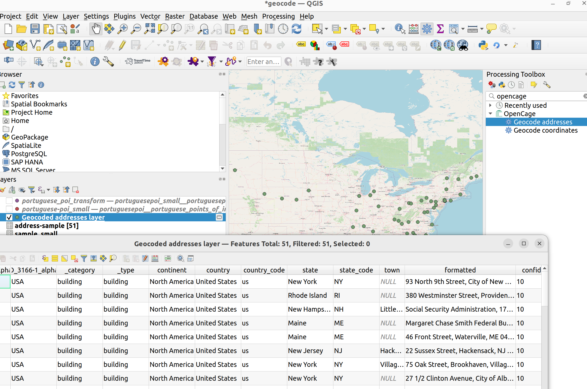

# OpenCage Geocoder QGIS Plugin

This processing plugin enables forward and reverse geocoding using the [OpenCage Geocoding API](https://opencagedata.com). In order to use it, you need to [sign up](https://opencagedata.com/users/sign_up) for an API key first. Sign up is quick and free.

## Manual Install

You can do this, if you want to develop/test the plugin. Once the it is available through the [plugin hub](https://plugins.qgis.org/), you can install it through the [plugin manager](https://docs.qgis.org/3.28/en/docs/training_manual/qgis_plugins/fetching_plugins.html).

### Short Version

* Copy the entire directory containing the plugin to the QGIS plugin directory
* Enable the plugin the QGIS plugin manager

### Long Version

1. Copy the source code to the plugin Folder

The source code is the sub-folder `opencage_geocoder`, on this repository. To find out where the plugin folder is located in your machine, in the top-level menu of QGIS choose `Settings->User Profiles->Open Active Folder`.  From that path, navigate to `Python->Plugins`


After copying the files, you may need to restart QGIS in order for the plugin to be detected.

1. Enable the plugin in the QGIS plugin manager

Access the top level menu and choose `Plugins->Install Plugins`.


 On the left panel, select `Installed`: the opencage geocoder plugin should be listed. Select it to enable it and close the dialog.

 

## Using the Plugin

After enabling the plugin, its algorithms will be available in the `processing toolbox`. To enable the toolbox choose `Processing->Toolbox` in the top level menu. This will enable panel on the right side of QGIS.

 

You can browse the processing panel to find the `Opencage` provider, or type `opencage` in the searchbar, to filter it. Under the `Opencage` provider, you will find the available algorithms. You can click any of them to run them.

 

### Forward Geocoding - geocoding addresses

Before runnning this algorithm you will need a text file (csv), with a field which contains locations in natural language (addresses, cities, postcodes); this will be the input of the geocoding algorithm. You can use the [sample](./opencage_geocoder/test/data/sample_small.csv) provided in the test folder. Add it to QGIS, by dragging the file into the layers panel on the left

 

To run the forward geocoding algorithm, click in `Geocoding addresses`. This will open a dialog with options. In the input layer, choose the file you just added (it should be added by default, if you don't have any more layers). Then select the field which contains the location you want to geocode; in this case, `Morada`. Select the other options as appropriate and choose `Run`. 

 

The geocode process will run in the background and show you a log of what is happening. When completed it will automatically add a vector file to the QGIS layer browser, which contains the geocoded locations, along with other structured information (depending on the options you selected). If you want to persist this file, you should export the layer to a geospatial format (e.g.: Geopackage, GeoJSON, etc).

 

The original address used for geocoding is appended as an attribute. 



### Reverse Geocoding - geocoding coordinates

Before runnning this algorithm you will need a vector file with point geometries (e.g.: GeoPackage, GeoJSON, etc); this will be the input of the geocoding algorithm. You can use the [sample](./opencage_geocoder/test/data/portuguese-poi_small.gpkg) provided in the test folder. Add it to QGIS, by dragging the file into the layers panel on the left. You can use a vector file with any CRS; regardless, the geometries will always be projected to WGS84 during geocoding and the result file will always be in that projection.

 

To run the reverse geocoding algorithm, click in `Geocoding coordinates`. This will open a dialog with options. In the input layer, choose the file you just added (it should be added by default, if you don't have any more layers). Select the other options as appropriate and choose `Run`. 

 

The geocode process will run in the background and show you a log of what is happening. When completed it will automatically add a vector file to the QGIS layer browser, which contains the geocoded locations, along with other structured information (depending on the options you selected). If you want to persist this file, you should export the layer to a geospatial format (e.g.: Geopackage, GeoJSON, etc).

 

The coordinates used for geocoding are appended as attributes. They are always translated to WGS84, if they were originally in a different CRS.


## Develop

  For information on writing PyQGIS code, see http://loc8.cc/pyqgis_resources for a list of resources.

## Test

You can run the unit tests on the [test folder](./test/).

Run all tests:

```bash
pytest-3 opencage_geocoder/test/
```
Run specific test:

```bash
 pytest-3 opencage_geocoder/test/test_forward_geocoder.py 
```

Before running the tests, you need to export your OpenCage key as an environment variable:

```bash
 export OPENCAGE_KEY=[your-key-here]
```

### Sample Data

The [data](./opencage_geocoder/test/data/) folder contains sample data that can be used in the unit tests.

* [sample_large.csv](./opencage_geocoder/test/data/sample_large.csv): The IVAUCHER dataset was made available by the Portuguese government in 2021, during the IVAUCHER program; it contains a list of gas stations addresses in Portugal. This program, along with the website where the data was available, were now deactivated. You can read the complete story [here](https://doublebyteblog.wordpress.com/2021/11/16/mapping-the-ivaucher/).
* [sample_small.csv](./opencage_geocoder/test/data/sample_small.csv): Subset of sample_large.csv. 
* [portuguese-poi.gpkg](./opencage_geocoder/test/data/portuguese-poi.gpkg): Portuguese Points of Interest obtained from OpenStreetMap. Dataset includes Madeira and Azores islands. Uses [GeoPackage](https://www.geopackage.org/) backend via OGR provider. This dataset was obtained from a [pygeoapi collection](https://demo.pygeoapi.io/master/collections/ogr_gpkg_poi).
* [portuguese-poi_small.gpkg](./opencage_geocoder/test/data/portuguese-poi_small.gpkg): Subset of portuguese-poi.gpkg.

## Who is OpenCage GmbH?

<a href="https://opencagedata.com"></a>

We run the [OpenCage Geocoding API](https://opencagedata.com). Learn more [about us](https://opencagedata.com/about). 

We also run [Geomob](https://thegeomob.com), a series of regular meetups for location based service creators, where we do our best to highlight geoinnovation. If you like geo stuff, you will probably enjoy [the Geomob podcast](https://thegeomob.com/podcast/).